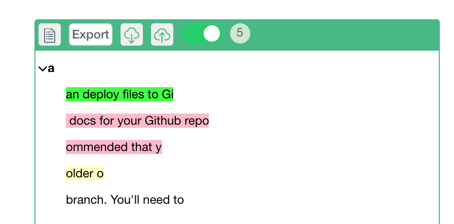

# docsify-highlight

## Build From source code

1. `npm install`

2. `npm run build`

## Usage

## Basic Usage

1. Include vue.js

    `<script src="https://unpkg.com/vue/dist/vue.js"></script>`

2. Include js and css

    `<link rel="stylesheet" href="//unpkg.com/iview/dist/styles/iview.css">`

    `<link rel="stylesheet" href="dist/docsify-highlight.css">`

    `<script src="dist/docsify-highlight.umd.min.js"></script>`
    

## Use CDN directly

   `<link rel="stylesheet" href="//unpkg.com/iview/dist/styles/iview.css">`

   `<link rel="stylesheet" href="https://cdn.jsdelivr.net/npm/docsify-highlight@latest/docsify-highlight.min.css">`
   
   `<script src="https://cdn.jsdelivr.net/npm/docsify-highlight@latest/docsify-highlight.umd.min.js"></script>`

## Optional usage

1. Use leancloud as remote storage 

```
  window.$docsify = {
      "DocHighlighter": {
        leancloud: {
          appId: "appId",
          appKey: "appKey",
          serverURL: "https://xxxxxxxx",
        }
      },
    };

```
## ScreenShot

1. **Highlight**


2. **Table of Content**


